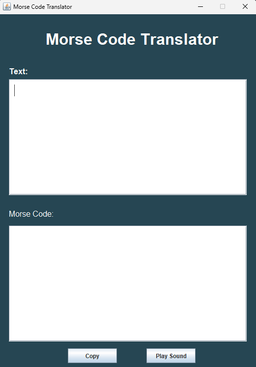

# Morse Code Translator GUI

## Overview
The **Morse Code Translator GUI** is a Java-based desktop application that allows users to convert text into Morse code. It features a graphical user interface (GUI) using `JFrame` and provides functionalities to copy the Morse code output and play it as an audible signal.

## Features
- Convert English text into Morse code dynamically.
- Copy Morse code output to the clipboard.
- Play Morse code as sound.
- Interactive graphical user interface with a modern design.

## Technologies Used
- Java (Swing for GUI development)
- Java Sound API (for Morse code audio playback)

## Installation & Usage

### Prerequisites
- Ensure you have **Java 8+** installed on your system.

### Steps to Run
1. Clone the repository:
   ```sh
   git clone https://github.com/your-repo/morse-code-translator.git
   cd morse-code-translator
   ```
2. Compile the Java files:
   ```sh
   javac App.java MorseCodeTranslatorGUI.java MorseCodeController.java
   ```
3. Run the application:
   ```sh
   java App
   ```

## File Structure
```
├── App.java                     # Entry point of the application
├── MorseCodeTranslatorGUI.java  # Main GUI application
├── MorseCodeController.java     # Handles Morse code translation and sound playback
├── README.md                    # Documentation
```

## How It Works
1. **Text Input:** Users enter text in the provided text area.
2. **Morse Code Output:** The application converts the text into Morse code in real-time.
3. **Copy Feature:** Users can copy the Morse code output with a button click.
4. **Play Sound:** Users can play the Morse code as sound using the `Play Sound` button.

## Screenshots



## Future Enhancements
- Support for Morse code to text translation.
- Dark mode and customizable themes.
- Export Morse code output as a file.

## License
This project is licensed under the MIT License - see the [LICENSE](LICENSE) file for details.

## Author
Your Name (Replace with your name)

